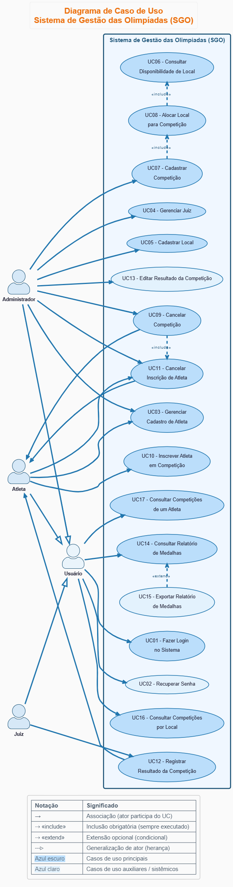
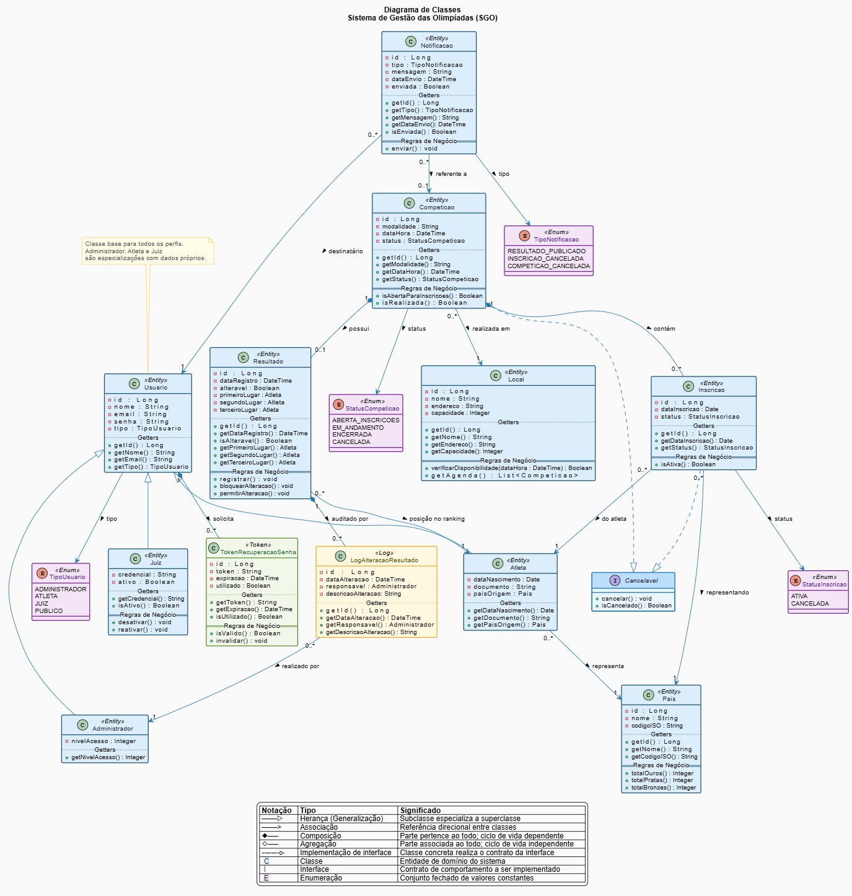
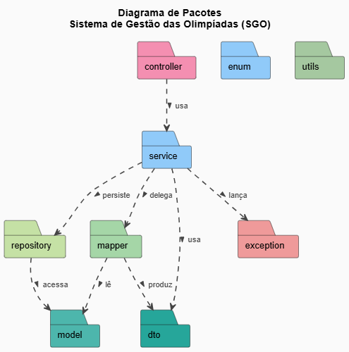
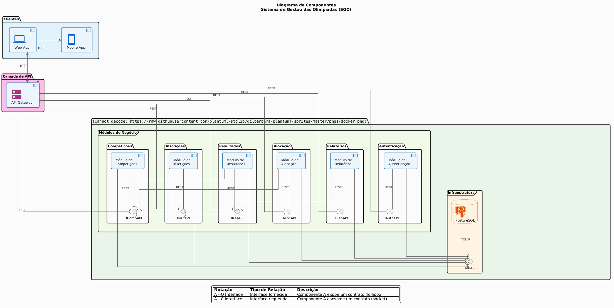
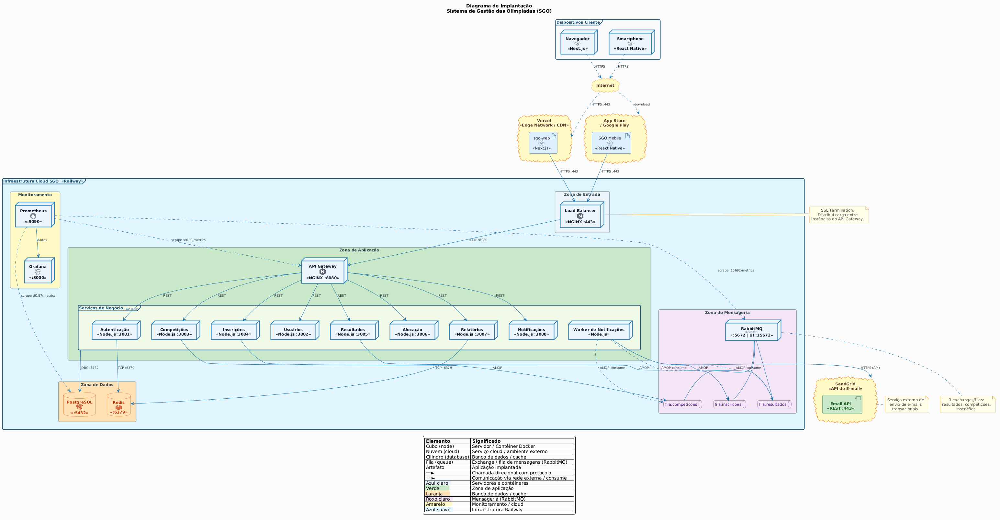
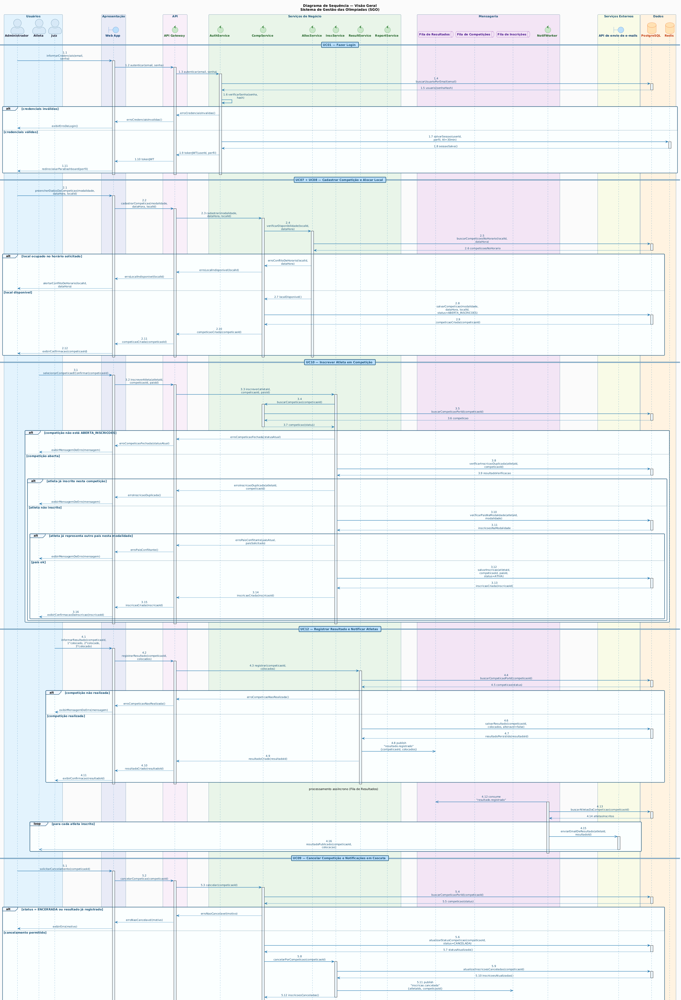

<div align="center">
  
</div>

<br/>

# 🏅 Sistema de Gestão das Olimpíadas (SGO)

> Trabalho 1 — Primeira Entrega | Projeto de Software | PUC Minas  
> Disciplina ministrada pelo Prof. João Paulo Carneiro Aramuni


O **SGO — Sistema de Gestão das Olimpíadas** é um sistema modelado para coordenar os diferentes aspectos de um evento olímpico. O sistema contempla o gerenciamento de competições, inscrições de atletas, alocação de locais para as provas e controle de resultados, além da geração de relatórios de medalhas por país.

---

## 📚 Sumário

- [Sobre o Projeto](#-sobre-o-projeto)
- [Regras de Negócio](#-regras-de-negócio)
- [Histórias de Usuário](#-histórias-de-usuário)
- [Diagramas UML](#-diagramas-uml)
  - [Diagrama de Caso de Uso](#diagrama-de-caso-de-uso)
  - [Diagrama de Classes e de Pacotes](#diagrama-de-classes-e-de-pacotes)
  - [Diagrama de Componentes](#diagrama-de-componentes)
  - [Diagrama de Implantação](#diagrama-de-implantação)
  - [Diagrama de Sequência](#diagrama-de-sequência)
- [Estrutura do Repositório](#-estrutura-do-repositório)
- [Documentação Utilizada](#-documentação-utilizada)
- [Autora](#-autora)

---

## 📝 Sobre o Projeto

Com a chegada das Olimpíadas, um novo sistema de gestão é necessário para coordenar os diferentes aspectos do evento. O SGO permite o gerenciamento de competições, inscrições de atletas de diferentes países, alocação de locais para as provas sem conflitos de horário, controle dos resultados das disputas e geração de relatórios de medalhas.

Este projeto é desenvolvido no contexto da disciplina de **Projeto de Software** do curso de Engenharia de Software da PUC Minas, com foco na **modelagem e diagramação UML**, sem necessidade de implementação de código.

---

## 📋 Regras de Negócio

1. **Cadastro de competições:** o sistema deve permitir o cadastro de competições, incluindo nome da modalidade, data, horário, local e lista de atletas inscritos.
2. **Inscrição de atletas:** atletas de diferentes países podem se inscrever em competições específicas. Cada atleta pode participar de várias competições, mas só pode representar um país por modalidade.
3. **Alocação de locais:** os locais devem ser alocados evitando conflitos de horário — um local só pode abrigar uma competição por vez.
4. **Controle de resultados:** após cada competição, os resultados devem ser registrados com o 1º, 2º e 3º colocados.
5. **Relatórios de medalhas:** o sistema deve gerar relatórios com o desempenho de cada país em ouro, prata e bronze.

---

## 📖 Histórias de Usuário

### US01 — Cadastrar Competição
**Como** administrador do sistema,  
**Quero** cadastrar uma nova competição informando modalidade, data, horário e local,  
**Para que** o evento esteja devidamente registrado e disponível para inscrições de atletas.

**Critérios de aceitação:**
- O sistema deve exigir nome da modalidade, data, horário e local.
- A competição deve ser salva com status "aberta para inscrições".
- Não deve ser possível cadastrar duas competições no mesmo local e horário.

---

### US02 — Inscrever Atleta em Competição
**Como** atleta,  
**Quero** me inscrever em uma competição específica,  
**Para que** ele possa participar da disputa em sua modalidade representando um país.

**Critérios de aceitação:**
- Um atleta pode ser inscrito em várias competições.
- Um atleta só pode representar um único país por modalidade.
- O sistema deve impedir inscrição duplicada do mesmo atleta na mesma competição.

---

### US03 — Alocar Local para Competição
**Como** administrador do sistema,  
**Quero** alocar um local disponível para uma competição,  
**Para que** não haja conflito de uso de espaço entre diferentes eventos.

**Critérios de aceitação:**
- O sistema deve verificar a disponibilidade do local na data e horário informados.
- Caso o local já esteja ocupado, o sistema deve alertar e bloquear a alocação.
- A alocação deve ficar registrada e visível na agenda do local.

---
### US04 — Cancelar Competição
**Como** administrador do sistema,  
**Quero** cancelar uma competição,  
**Para que** a competição seja retirada da agenda, as inscrições sejam encerradas e o local fique disponível para nova alocação quando o evento não puder mais ocorrer.

**Critérios de aceitação:**
- Somente um usuário com perfil de administrador pode cancelar uma competição.
- O sistema permite cancelar competições nos status `agendada` ou `aberta para inscrições`; não deve permitir cancelamento de competições com resultados registrados (`realizada`).
- Ao cancelar, a competição recebe o status **cancelada**
- Todas as inscrições vinculadas à competição são marcadas como **canceladas** e os atletas são notificados.
- O local e o horário ficam liberados na agenda para novas alocações.
- Após o cancelamento, não é possível inscrever novos atletas nem registrar resultados, exceto se um administrador reverter explicitamente o cancelamento.
---

### US05 — Registrar Resultado de Competição
**Como** juiz,  
**Quero** registrar o resultado de uma competição informando os atletas classificados em 1º, 2º e 3º lugar,  
**Para que** as medalhas sejam atribuídas corretamente a cada país.

**Critérios de aceitação:**
- O resultado só pode ser registrado para competições já realizadas.
- Devem ser informados exatamente os três primeiros colocados.
- Após o registro, o resultado não deve poder ser alterado sem permissão de administrador.

---

### US06 — Consultar Relatório de Medalhas
**Como** usuário do sistema (administrador, imprensa ou público),  
**Quero** consultar o relatório de medalhas por país,  
**Para que** seja possível acompanhar o desempenho de cada nação ao longo das Olimpíadas.

**Critérios de aceitação:**
- O relatório deve exibir a quantidade de medalhas de ouro, prata e bronze por país.
- A listagem deve ser ordenada pelo número de ouros, com desempate por pratas e bronzes.
- O relatório deve ser atualizado automaticamente após cada resultado registrado.

---

### US07 — Consultar Competições por Local
**Como** usuário do sistema,  
**Quero** visualizar todas as competições agendadas em um determinado local,  
**Para que** seja possível verificar a agenda de uso daquele espaço.

**Critérios de aceitação:**
- O sistema deve listar as competições filtradas por local.
- As competições devem ser exibidas em ordem cronológica.

---

### US08 — Consultar Competições de um Atleta
**Como** usuário do sistema,  
**Quero** consultar todas as competições nas quais um atleta está inscrito,  
**Para que** seja possível acompanhar a agenda e os resultados desse atleta.

**Critérios de aceitação:**
- A busca pode ser feita pelo nome ou identificador do atleta.
- O sistema deve exibir as competições com status (agendada, realizada) e resultados quando disponíveis.

---

### US09 — Fazer Login no Sistema
**Como** usuário cadastrado,
**Quero** me autenticar com e-mail e senha,
**Para que** eu possa acessar as funcionalidades correspondentes ao meu perfil com segurança.

**Critérios de aceitação:**
- O sistema deve validar e-mail e senha; credenciais inválidas devem exibir mensagem de erro sem revelar qual campo está incorreto.
- Após autenticação bem-sucedida, o usuário deve ser redirecionado para a tela principal do seu perfil.
- Sessões inativas por mais de 30 minutos devem ser encerradas automaticamente.
- Usuários sem autenticação não podem acessar nenhuma funcionalidade protegida.

---

### US10 — Recuperar Senha
**Como** usuário cadastrado,
**Quero** recuperar o acesso à minha conta via e-mail,
**Para que** eu possa redefinir minha senha caso a esqueça.

**Critérios de aceitação:**
- O sistema envia um link de redefinição para o e-mail cadastrado com validade de 1 hora.
- Após redefinição, o link deve ser invalidado imediatamente.
- O sistema não deve confirmar nem negar se o e-mail existe, por segurança.

---

**US11 — Gerenciar Juiz**
**Como** administrador,
**Quero** cadastrar, editar e desativar juízes,
**Para que** apenas pessoas autorizadas possam avaliar as competições e definir os resultados.

**Critérios de aceitação:**
- Juizes desativados não podem fazer login, mas seus dados históricos são preservados.

---

### US12 — Receber Notificação de Resultado Publicado
**Como** atleta inscrito em uma competição,
**Quero** ser notificado quando o resultado da minha competição for registrado,
**Para que** eu saiba minha colocação final sem precisar consultar o sistema manualmente.

**Critérios de aceitação:**
- A notificação deve ser enviada imediatamente após o registro do resultado.
- A notificação deve informar a modalidade, data da competição e a colocação do atleta (1º, 2º ou 3º lugar, ou "não classificado no pódio").
- O canal de notificação deve ser o e-mail cadastrado do atleta.

---

### US13 — Receber Notificação de Inscrição Cancelada
**Como** atleta,
**Quero** ser notificado quando minha inscrição em uma competição for cancelada,
**Para que** eu esteja ciente da alteração e possa tomar providências se necessário.

**Critérios de aceitação:**
- A notificação deve ser disparada tanto no cancelamento individual da inscrição quanto no cancelamento da competição inteira (US04).
- A mensagem deve indicar o nome da modalidade, data e o motivo do cancelamento quando disponível.
- A notificação deve ser enviada por e-mail.

---

### US14 — Receber Notificação de Competição Cancelada
**Como** atleta inscrito em uma competição,
**Quero** ser notificado quando uma competição em que estou inscrito for cancelada pelo administrador,
**Para que** eu possa reorganizar minha agenda com antecedência.

**Critérios de aceitação:**
- Todos os atletas com inscrição ativa na competição devem receber a notificação.
- A notificação deve ser enviada logo após a ação de cancelamento pelo administrador.
- Deve conter: nome da modalidade, data/horário que estava agendado e instrução de contato caso necessário.

---

### US15 — Cadastrar Local
**Como** administrador,
**Quero** cadastrar locais disponíveis para realização de competições,
**Para que** eles possam ser alocados às competições respeitando a capacidade e disponibilidade.

**Critérios de aceitação:**
- O cadastro deve incluir nome, endereço e capacidade máxima do local.
- Não deve ser permitido cadastrar dois locais com o mesmo nome e endereço.
- O local deve ficar disponível para alocação imediatamente após o cadastro.

---

### US16 — Consultar Disponibilidade de Local
**Como** administrador,
**Quero** consultar a agenda de um local para uma data e horário específicos,
**Para que** eu possa verificar se ele está disponível antes de alocar uma competição.

**Critérios de aceitação:**
- O sistema deve exibir todas as competições já alocadas no local na data consultada.
- Deve indicar claramente os horários ocupados e os disponíveis.
- A consulta deve estar disponível sem necessidade de iniciar o fluxo de cadastro de competição.

---

### US17 — Editar Resultado com Permissão de Administrador
**Como** administrador,
**Quero** autorizar e realizar a edição de um resultado já registrado,
**Para que** erros de registro possam ser corrigidos em situações excepcionais.

**Critérios de aceitação:**
- Somente o administrador pode desbloquear e editar um resultado após o registro inicial.
- Toda alteração deve ser registrada em log com o usuário responsável, data e hora.
- Após a edição, o relatório de medalhas deve ser recalculado automaticamente.

---

### US18 — Exportar Relatório de Medalhas
**Como** usuário do sistema,
**Quero** exportar o relatório de medalhas em formato PDF ou CSV,
**Para que** o resultado possa ser compartilhado e divulgado fora do sistema.

**Critérios de aceitação:**
- O relatório exportado deve refletir o estado atual do quadro de medalhas no momento da exportação.
- O formato PDF deve ter layout legível e identificado com nome do evento e data de geração.
- O formato CSV deve conter colunas: País, Ouros, Pratas, Bronzes, Total.

---

### US19 — Gerenciar Cadastro de Atleta
**Como** atleta,
**Quero** cadastrar, editar e excluir meu próprio cadastro no sistema,
**Para que** meus dados estejam sempre corretos e atualizados para participação nas competições.

**Critérios de aceitação:**
- No cadastro, os campos obrigatórios são: nome completo, data de nascimento, documento de identidade, país de origem e e-mail.
- O sistema deve impedir o cadastro de dois atletas com o mesmo documento ou e-mail.
- O atleta pode editar seus dados cadastrais a qualquer momento, exceto documento de identidade — que só pode ser alterado por um administrador.

## 📊 Diagramas UML

### Diagrama de Caso de Uso


---

### Diagrama de Classes e de Pacotes



---

### Diagrama de Componentes


---

### Diagrama de Implantação



---
### Diagrama de Sequência


---

## 📁 Estrutura do Repositório

```
sgo/
│
├── README.md
│
├── imagens/
│   ├── diagrama-de-caso-de-uso.png
│   ├── diagrama-de-classes.png
│   ├── diagrama-de-pacotes.png
│   ├── diagrama-de-componentes.png
│   ├── diagrama-de-sequencia.png
│   └── diagrama-de-implantacao.png
│
└── codigos/
    ├── diagrama-de-caso-de-uso.puml
    ├── diagrama-de-classes.puml
    ├── diagrama-de-pacotes.puml
    ├── diagrama-de-componentes.puml
    ├── diagrama-de-sequencia.puml
    └── diagrama-de-implantacao.puml
```

---

## 🔗 Documentação Utilizada

- 📖 [PlantUML — Site Oficial](https://plantuml.com/)
- 📖 [PlantUML — Guia Completo](https://plantuml.com/guide)

---

## 👩‍💻 Autora

| 👤 Nome          | 🖼️ Foto                                                                                                                        |GitHub                                                                                                                                                    | 💼 LinkedIn                                                                                                                                                                            | 📤 Gmail                                                                                                                                                     |
| ---------------- | ------------------------------------------------------------------------------------------------------------------------------ | ------------------------------------------------------------------------------------------------------------------------------------------------------------------- | -------------------------------------------------------------------------------------------------------------------------------------------------------------------------------------- | ------------------------------------------------------------------------------------------------------------------------------------------------------------ |
| Laura Campos Pontara Lopes    | <div align="center"></div> | <div align="center"><a href="https://github.com/LauraPontara"></a></div> | <div align="center"><a href="https://linkedin.com/in/laura-pontara"></a></div>            | <div align="center"><a href="mailto:lauracampospl@gmail.com"></a></div>    |


---

> Trabalho desenvolvido para a disciplina de **Projeto de Software** — PUC Minas, 4º Período  
> Professor: João Paulo Carneiro Aramuni